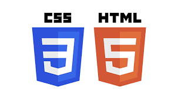

# 👋 Hi, I'm Mel! 👋 
⚡ Junior Software Developer | Python, SQL, PHP, phpMyAdmin, RESTful APIs, HTML, CSS, Wordpress, Selenium |\
_Passionate about building scalable and efficient solutions with a background in clinical systems & healthcare solutions_

## ❔ **Who Am I** ❔

After 20 years of developing and leading clinical systems solutions and projects, I've taken the leap and started the transition into software development, with a focus on backend technologies.

I've always loved geeking out and learning to code (shoutout to my Codecademy days!), but things really levelled up when I completed the **Code First Girls Software Engineering** nanodegree with Distinction. Since then, I've been having fun designing and building a mix of personal and group projects and continue to expand my knowledge and experience.

My background in managing clinical systems projects  demonstrates effective problem-solving, teamwork, understanding of the SDLC and the importance of building robust user-friendly solutions.

I typically find myself in the role where people look to me for support and guidance or help to fix a problem. Give me a bug to fix or a problem to solve and I'll be there ready to geek out and feeling super excited inside! 😄

## ⚒️ Toolbox ⚒️

 

 

 

 

 

 

## 👩🏻‍💻 Currently working on...👩🏻‍💻
- GP_Appointment_Checker: Selenium automation to check for new appointments and send e-mail notifications.
- Wordpress/PHP learning portal: Enhancing customised plugins and developing new features _(Work project)_
- Dog Tricks Tracker web app _(Personal Project)_

## 🗂️ Projects I have worked on so far...🗂️

- **Questive**: Co-developed a trivia-based murder mystery game (Python, SQL, Pygame, API)
- **Frosty**: The Runaway Snowman! Shooter-style game for Code Jam, deployed to web using Pygbag
- **Dogtective**: Collaborative team-built retro-style dodge game (Python, SQL, Pygame)
-	**Pizza Menu API**: Created a local RESTful API to manage a pizza menu (Flask, MySQL, Insomnia)
-	**Primary Care Database**: Designed a mini SQL database with stored procedures
-	**Weather Hi-Lo Game**: Text-based Python game with weather + poetry APIs
-	**Pokémon Top Trumps**: Co-developed text-based game (Python, Turtle, Pokémon API)
- **Monthly budget planner**: Developed an automated VBA script to streamline personal finance management.

## 😄 Fun Facts 😎
- 🐶 I love to teach my little Cavachon new tricks, and she loves getting lots of treats!
- 🎭 Theatre lover and former amateur actress *(and a tiny embarrassing spot of pro!)*

*_I'd love to connect and collaborate on projects!_*\
[Connect with me on LinkedIn!](https://www.linkedin.com/in/melanie-clark-3b948118/)
