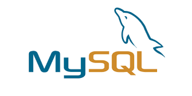
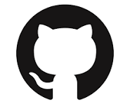
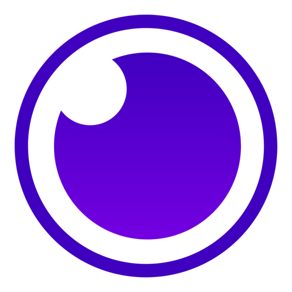

# 👋 Hi, I'm Mel!
⚡ **Backend Developer | Python, SQL, PHP, APIs | Clinical Systems & Data Solutions**

## ❔ **Who Am I** ❔

With 20 years of experience as a Clinical System Project Lead and Specialist, I’m transitioning into software development, focusing on backend technologies.

I've always loved geeking out and learning to code and over the years have dabbled in the likes of Codecademy. However, after graduating from the **Code First Girls Software Engineering** nanodegree, in which I earned a Distinction, I took the opportunity to push myself to be creative and to design & develop projects, both personal and group.

My background in managing clinical systems projects has evidenced effective problem-solving, SDLC, and the importance of building reliable, user-friendly solutions. 

## ⚒️ Toolbox ⚒️

 

 

